SPDX-FileCopyrightText: 2026 Santosh Prabhu Shenbagamoorthy and Santhosh Shyamsundar
SPDX-License-Identifier: MIT
<!--
-->
<!-- markdownlint-disable-file MD013 MD040 MD001 MD026 — hero README is intentionally dense; other docs stay strict via shared config. -->

# Universal Calendar Resolution Spine

**Repository:** ``tytolabs/umst-ucrs`` — **time** fiber: temporal witness / stamp spine + gate-checked sync economics.

<!-- readme:status -->
[](https://github.com/tytolabs/umst-ucrs/actions/workflows/rust.yml)
[](https://github.com/tytolabs/umst-ucrs/actions/workflows/lean.yml)
[](https://github.com/tytolabs/umst-ucrs/actions/workflows/haskell.yml)
[](https://github.com/tytolabs/umst-ucrs/actions/workflows/python.yml)
[](LICENSE)
<!-- /readme:status -->

> _This ecosystem is dedicated to the thousands of unnamed contributors who wrote formal proofs, maintained open-source compilers, and built mathematical libraries for years — often without evidence that any of it would be used beyond pure theory. They chose to make their work free, because they understood that knowledge about physical reality cannot be owned. Whatever this system achieves is yours._

### Time spine in plain words

Time is not a free coordinate. Every agent that claims to share a “now” with another agent is making a **measurement** — resolving uncertainty about phase offset at the Landauer floor. UCRS encodes that price in code: sync only when the gate admits it, stamp every durable accept with **when** and **how much information** was spent, and route multi-agent credit so accurate clocks become preferred sync partners. The **spine** (`Frame` → `Vertebra` → `DesignSheafOverSpine`) is the time-axis under those stamps — the **time morphism** Matter / Knowing / Acting compose through.

**Gloss.** “Calendar” here means systems of time-representation (Y2038-class epoch/clock drift), not appointments; UCRS is the constitutional-time and temporal-provenance spine.

**Role.** The **time** organ of the shared thermodynamic admissibility gate: a Rust library that makes time itself gate-checked and Landauer-frugal — multi-agent sync economics **and** a generic temporal-witness / stamp spine for design steps across the stack.

**The gate idea.** Every sync is a typed measurement that resolves phase uncertainty at the Landauer floor (`k_B T ln 2` J/bit). Sync fires only when `gate_check` admits it against desync-energy budget and Clausius–Duhem on ψ; wasteful paths are **rejected** — structural accept/reject, not a soft penalty.

### Shared stack (matter · knowing · acting · time)

These public repos share **one** thermodynamic admissibility gate, applied across domains:

| Domain | Public repo | Role |
|:---|:---|:---|
| **Matter** | ``umst-manifold`` + ``umst-concrete-cartridge`` | DEC carrier + cementitious constitutive law |
| **Knowing** | ``umst-formal-double-slit`` | Observation / measurement-cost formal fiber |
| **Acting** | ``umst-formal`` | Economic-admissibility formal fiber |
| **Time** | **this repo** (``umst-ucrs``) **← you are here** | Temporal witness / stamp spine |

Sibling links only — no paper-series arc naming in this README. Already-public per-repo DOI badges stay where they exist; this repo does not invent new ones here.

**Time substrate** (stamp spine + sync economics). Physics runtime, catalog lock, and cold-edge MCP live in ``umst-manifold`` and ``umst-concrete-cartridge``.

### Real objects (categorical — not “the system”)

| Symbol | Role (objects / morphisms) | Defined at |
|:---|:---|:---|
| `ClockThermState` | Object: desync energy, budget, T, monotone sync spend | [`Rust/src/gate.rs:15`](Rust/src/gate.rs) |
| `GateVerdict` / `gate_check` | Morphism: Admit \| Reject on Landauer cost + CD on ψ | [`Rust/src/gate.rs:28`](Rust/src/gate.rs), [`:44`](Rust/src/gate.rs) |
| `gated_sync` | Partial arrow: Admit → updated state; Reject → `None` | [`Rust/src/gate.rs:71`](Rust/src/gate.rs) |
| `landauer_cost` | Cost of resolving `bits` at temperature | [`Rust/src/landauer.rs:32`](Rust/src/landauer.rs) |
| `CreditLedger` | Object: per-peer accuracy credit; Byzantine collapse | [`Rust/src/credit.rs:59`](Rust/src/credit.rs) |
| `StampTier` | Enum: `UcrsTier2` \| `WallOnly` \| `Absent` \| `Synthetic` | [`Rust/src/observation.rs:21`](Rust/src/observation.rs) |
| `UcrsObservedAt` | Stamp object: `stamp_tier`, `ucrs_seq`, phase/credit fixed-point fields | [`Rust/src/observation.rs:42`](Rust/src/observation.rs) |
| `TemporalWitness` | Stateful producer: `stamp() → UcrsObservedAt` (Tier-2) | [`Rust/src/observation.rs:164`](Rust/src/observation.rs) |
| `Frame` / `SpineTime` / `Vertebra` / `Spine` | Frame + ordered vertebrae; each vertebra carries a stamp | [`Rust/src/frame_spine.rs:70`](Rust/src/frame_spine.rs), [`:87`](Rust/src/frame_spine.rs), [`:206`](Rust/src/frame_spine.rs), [`:218`](Rust/src/frame_spine.rs) |
| `SheafSection` / `DesignSheafOverSpine<M>` | Sections of admissibility along the spine time-axis | [`Rust/src/design_sheaf.rs:19`](Rust/src/design_sheaf.rs), [`:114`](Rust/src/design_sheaf.rs) |
| `SteerKnobs<L>` / `SteerDecision<W>` / `SteerPolicy<L,W>` | Generic steer routing (consumer supplies `L`, `W`) | [`Rust/src/decision_tree.rs:13`](Rust/src/decision_tree.rs), [`:22`](Rust/src/decision_tree.rs), [`:41`](Rust/src/decision_tree.rs) |
| `witness_for_agent` | Construct `TemporalWitness` from `AgentConfig` | [`Rust/src/lib.rs:87`](Rust/src/lib.rs) |

Wire schema for ticks: [`Rust/src/wire.rs`](Rust/src/wire.rs). Logging / HLC policy (HLC never overwrites `ucrs_seq`): [`Docs/LOGGING_POLICY.md`](Docs/LOGGING_POLICY.md) · [`Docs/HLC_SIDECAR.md`](Docs/HLC_SIDECAR.md).

<details>
<summary><strong>Table of contents</strong> (detailed map + outline)</summary>
<br>

**Top-level map**

| Block | Jump |
|:---|:---|
| Foundations | [§1](#1-core-idea-sync-as-measurement) · [§2](#2-architecture--stamp-pipeline) · [§3](#3-cross-domain-integration-specifications) |
| Layout & ops | [§4](#4-exhaustive-repository-topology) · [§5](#5-surfaces--entrypoints) · [§6](#6-quick-start) |
| Verification & docs | [§7](#7-cross-language--formal-track) · [§8](#8-documentation-hub) |
| Agents & wrap-up | [§9](#9-special-protocol-note-to-autonomous-ai-agents--systems) · [§10](#10-honesty-and-limits) · [§11](#11-conclusion-inferences--forward-path) · [Related](#related-repositories) · [Authors](#authors) · [Acknowledgments](#acknowledgments) · [Contributing](#contributing) · [Citation](#citation) · [License](#license) |

**Detailed outline** — every entry links to a stable anchor (`README.md#…`); collapsible sections use `<details>` but share the same deep-link fragments.

- [§1 Core idea (sync as measurement)](#1-core-idea-sync-as-measurement)
- [§2 Architecture / stamp pipeline](#2-architecture--stamp-pipeline)
- [§3 Cross-Domain Integration Specifications](#3-cross-domain-integration-specifications)
  - [3.1 Multi-agent sync economics](#31-multi-agent-sync-economics)
  - [3.2 Stamp / memory provenance](#32-stamp--memory-provenance)
  - [3.3 Design spine / sheaf](#33-design-spine--sheaf)
  - [3.4 Formal track honesty](#34-formal-track-honesty)
- [§4 Repository topology](#4-exhaustive-repository-topology)
- [§5 Surfaces & entrypoints](#5-surfaces--entrypoints)
- [§6 Quick Start](#6-quick-start)
- [§7 Cross-language / formal track](#7-cross-language--formal-track)
- [§8 Documentation hub](#8-documentation-hub)
- [§9 Special Protocol: Agents](#9-special-protocol-note-to-autonomous-ai-agents--systems)
  - [9.1 Shared stack](#91-shared-stack-gate-spine)
  - [9.2 Hot vs cold](#92-hot-vs-cold-this-fiber)
  - [9.3 Guarantees](#93-guarantees-fileline)
  - [9.4 Operational mapping](#94-operational-mapping)
  - [9.5 Proposed](#95-proposed-not-yet-built)
  - [9.6 Principles](#96-principles)
- [§10 Honesty and limits](#10-honesty-and-limits)
- [§11 Conclusion](#11-conclusion-inferences--forward-path)
  - [What this repo demonstrates](#what-this-repo-demonstrates)
  - [What surprised us](#what-surprised-us)
  - [Forward path](#forward-path)
- [Related repositories](#related-repositories)
- [Authors](#authors)
- [Acknowledgments](#acknowledgments)
- [Contributing](#contributing)
- [Citation](#citation)
- [License](#license)

</details>

---
## 1. Core idea (sync as measurement)

Atomic clocks give a precise physical *tick*. UCRS sits **above** them and does what they cannot: it measures **temporal drift** between clocks and agents, and forces each sync to pay only the **Landauer-floor** cost to resolve phase uncertainty. If a sync path would cost more than it returns, the thermodynamic gate **rejects** it.

Two faces, one substance:

1. **Constitutional time-sync** — `LocalClock` / `CreditLedger` / `landauer_cost` / optional P2P / RAPL telemetry. Accuracy is tradeable as credit; Byzantine peers lose credit without a separate BFT protocol ([`CREDIT-SYSTEM.md`](CREDIT-SYSTEM.md)).
2. **Generic witness / stamp spine** — `frame_spine` / `design_sheaf` / `decision_tree` expose witness, stamp, and steer-routing primitives. Domain steering moved to consumer crates in the infra-purity refactor.

> **The simple version:** a shared, gate-checked *now* — agents spend energy only when it improves their understanding of the present, and every durable accept can carry that thermodynamic time.

**Mathematical spine (informal).** Let `H(phase_j | phase_i)` be conditional entropy resolved by a sync edge. Landauer cost is `E = k_B T ln(2) · H`. The credit ledger tracks bit transfers; greedy peer selection minimizes total `E` under accuracy constraints ([`CREDIT-SYSTEM.md`](CREDIT-SYSTEM.md) §4). Clock admissibility reuses the manifold / formal gate family (`clausius_duhem_admissible` via `umst-math`; formal `gateCheck` in ``umst-formal``), specialized to desync-energy budgets.

<details>
<summary><strong>Landauer + credit properties (from CREDIT-SYSTEM)</strong></summary>

1. **Conservation:** Total credit across the network is constant (zero-sum transfers).
2. **Accuracy ↔ credit:** Low-drift peers gain credit → preferred sync partners → lower total network cost.
3. **Landauer floor:** No agent gains more credit than bits of uncertainty resolved — credit supply bounded by entropy production.

Byzantine agents that lie about phase cause recipients' drift to **increase**; credit drops; greedy selection avoids them without a separate BFT protocol ([`CREDIT-SYSTEM.md`](CREDIT-SYSTEM.md) §4).

</details>

---

## 2. Architecture / stamp pipeline

```mermaid
flowchart TB
    subgraph timeFiber [UCRS time fiber]
        CW[ClockThermState]
        GC[gate_check / gated_sync]
        TW[TemporalWitness]
        ST[UcrsObservedAt stamp]
    end
    subgraph spine [Design spine]
        FR[Frame]
        VB[Vertebra + stamp]
        SP[Spine ordered vertebrae]
        SH[DesignSheafOverSpine sections]
    end
    subgraph siblings [Sibling fibers consume stamps]
        MAT[manifold / cartridge accept]
        KNO[double-slit observation cost]
        ACT[formal Kleisli step]
    end
    CW --> GC
    GC -->|Admit| TW
    TW --> ST
    FR --> VB --> SP --> SH
    ST --> MAT
    ST --> KNO
    ST --> ACT
```



**Compositional rule:** Matter / knowing / acting each run under the shared gate. UCRS supplies the **when + provenance** morphism: any admissible event can carry `UcrsObservedAt`. The spine (`Frame` → ordered `Vertebra` → `DesignSheafOverSpine`) is the time-axis under that stamp — not a second product.

**Stamp tiers (operational).** `StampTier::UcrsTier2` is the production witness path when `UMST_UCRS_WITNESS=live`. `WallOnly` and `Synthetic` are explicitly degraded modes — agents must not treat them as interchangeable with Tier-2 without labeling the downgrade ([`observation.rs:21–35`](Rust/src/observation.rs), [`Docs/LOGGING_POLICY.md`](Docs/LOGGING_POLICY.md)).

**HLC sidecar rule.** Hybrid logical clocks may annotate messages for ordering, but they **never** overwrite monotonic `ucrs_seq` on a stamp object. If your integration needs both, read [`Docs/HLC_SIDECAR.md`](Docs/HLC_SIDECAR.md) before wiring wire formats ([`wire.rs`](Rust/src/wire.rs)).

<details>
<summary><strong>Credit + sync protocol (summary)</strong></summary>

From [`CREDIT-SYSTEM.md`](CREDIT-SYSTEM.md):

```
PEER_SYNC(agent_i, agent_j):
  1. Exchange timestamp, drift, credit
  2. Compute H_cond = H(phase_j | message from i)
  3. gate_check: if k_B T ln(2) · H_cond > budget → REJECT
  4. Else ACCEPT: apply correction; transfer credit ΔC = H_cond
  5. Optional RAPL telemetry: E_measured ≥ Landauer floor
```

Greedy highest-credit peer selection is Landauer-optimal on tree sync topologies (proof sketch in CREDIT-SYSTEM; Lean L3 partial).

</details>

---

## 3. Cross-Domain Integration Specifications

**What this section is for.** Time is not a free coordinate. UCRS is the fiber that answers: *when did this commit land, and how much information was spent to share a “now”?* It **stamps** sibling fibers — it does not replace their physics or proofs. Open a persona below for surface, pipeline, outcome, and an honest limit.

Matter still validates constitutive law; Knowing still proves observation cost; Acting still owns Economic predicates. UCRS supplies the shared **when + provenance** vocabulary those commits compose through.

<a id="31-multi-agent-sync-economics"></a>
<details>
<summary><b>1. Multi-agent sync economics</b> (Mesh integrators, clock peers)</summary>

* **Domain Focus / Integration Surface:** Gate-checked clock sync — `LocalClock`, `CreditLedger`, `landauer_cost`, optional P2P mesh. Deep dive: [`CREDIT-SYSTEM.md`](CREDIT-SYSTEM.md).

* **Composition / Pipeline:** Sync only when Landauer cost fits the budget and Clausius–Duhem holds on the clock free-energy. Greedy peer selection prefers accurate clocks; Byzantine peers lose credit without a separate BFT protocol.

* **Computational Outcome:** A shared, gate-checked *now* — agents spend energy only when sync improves their understanding of phase offset, and accuracy becomes preferred sync credit.

* **Honest limit:** Not a production-complete mesh. `p2p` is feature-gated. Does not replace NTP/PTP ([`FOUNDATION.md`](FOUNDATION.md)).

</details>

<a id="32-stamp--memory-provenance"></a>
<details>
<summary><b>2. Stamp / memory provenance</b> (Memory ingest, agent MCP)</summary>

* **Domain Focus / Integration Surface:** `UcrsObservedAt`, `TemporalWitness`, `UMST_UCRS_WITNESS` — [`Rust/src/observation.rs`](Rust/src/observation.rs).

* **Composition / Pipeline:** Cartridge `ucrs-provenance` at memory accept. `witness_for_agent` ([`Rust/src/lib.rs:87`](Rust/src/lib.rs)) chooses Tier-2 vs synthetic. Catalog digest pin is **catalog** time-slice; stamp is **runtime** time.

* **Computational Outcome:** Monotonic `ucrs_seq` on durable accepts so Matter / Knowing / Acting events share one when+provenance record without inventing a second clock story.

* **Honest limit:** Does not validate constitutive law — the gate does. MCP host = concrete only; UCRS is a library.

</details>

<a id="33-design-spine--sheaf"></a>
<details>
<summary><b>3. Design spine / sheaf</b> (Design-time integrators)</summary>

* **Domain Focus / Integration Surface:** `Frame` → `Vertebra` → `DesignSheafOverSpine` — [`frame_spine.rs`](Rust/src/frame_spine.rs), [`design_sheaf.rs`](Rust/src/design_sheaf.rs).

* **Composition / Pipeline:** Generic witness / stamp spine. Domain steering purged @ `5a3df25` (infra-purity) — TNA/vault types live in consumer crates, not here.

* **Computational Outcome:** A time-axis structure Matter / Knowing / Acting can compose through under stamps, without UCRS storing mix recipes or contribution content.

* **Honest limit:** `MaterialEvolutionFrontier` and `SheafCohomologySeam` are **Proposed** (`built = false`). No mix recipes here — see cartridge ``contribution.v1``.

</details>

<a id="34-formal-track-honesty"></a>
<details>
<summary><b>4. Formal track honesty</b> (Lean L1–L8, catalog witnesses)</summary>

* **Domain Focus / Integration Surface:** Lean `Ucrs/` track — [`PROOF-STATUS.md`](PROOF-STATUS.md). Manifold ``ucrs-catalog.json`` is a tertiary fiber preview only.

* **Composition / Pipeline:** Rust `cargo test` + gate are authoritative for runtime. Lean L1–L2 proved; L3 partial Landauer bound; **L4–L8 proved** with content (zero `sorry`, zero `: True`, no new axiom) — see [`PROOF-STATUS.md`](PROOF-STATUS.md).

* **Computational Outcome:** Agents may cite L1–L8 Lean theorems where `lake build` succeeds; Rust gate + tests remain authoritative for runtime behaviour.

* **Honest limit:** Never hardcode rival catalog SHAs — re-open the manifold lock + count script.

</details>

**Cross-domain impact.** Without a shared stamp spine, “when” and “who paid thermodynamically” fragment across repos. UCRS makes **sync economics** and **provenance stamps** one composable layer so catalog witnesses, memory ingest, and formal fibers can align on a single `ucrs_seq` / `stamp_tier` vocabulary ([`Rust/src/observation.rs`](Rust/src/observation.rs)).

<details>
<summary><strong>Worked composition examples (no new claims)</strong></summary>

| Scenario | Matter / Knowing / Acting event | UCRS stamp role |
|:---|:---|:---|
| Cartridge `accept` after gate PASS | `contribution.v1` row written | `observed_at` / `ucrs_seq` on memory record |
| Formal catalog export consumed | Manifold witness R0 before hot gate | Digest pin is **catalog** time-slice; stamp is **runtime** time |
| Double-slit MI advisory | Observation cost computed in Lean | Stamp does not re-prove MI — links **when** cost was accounted |
| Agent MCP `umst_contribute` | Cold-edge stdio | `UMST_UCRS_WITNESS=synthetic` in CI; `live` for Tier-2 |

</details>

<details>
<summary><strong>What UCRS does NOT replace (scope guardrail)</strong></summary>

1. **NTP/PTP** — UCRS provides a thermodynamic sync framework; it does not replace network time protocols ([`FOUNDATION.md`](FOUNDATION.md)).
2. **Research memory** — mix recipes and hydration outcomes live in cartridge ``contribution.v1``.
3. **Domain steering** — TNA / vault logic in consumer crates post infra-purity.
4. **Hot physics** — DEC, solvers, arena mmap → ``umst-manifold``.

</details>

---

## 4. Exhaustive repository topology

<details>
<summary><strong>Repository tree</strong></summary>

```text
umst-ucrs/
├── Rust/                    # umst_ucrs library (primary deliverable)
│   ├── src/
│   │   ├── gate.rs          # ClockThermState, gate_check, gated_sync
│   │   ├── landauer.rs      # landauer_cost
│   │   ├── credit.rs        # CreditLedger
│   │   ├── observation.rs   # UcrsObservedAt, TemporalWitness
│   │   ├── frame_spine.rs   # Frame, Vertebra, Spine
│   │   ├── design_sheaf.rs  # DesignSheafOverSpine
│   │   ├── decision_tree.rs # SteerPolicy (generic)
│   │   ├── wire.rs          # wire v2 schema
│   │   ├── p2p.rs           # optional mesh (feature p2p)
│   │   └── bin/p2p.rs       # optional daemon
│   └── tests/               # integration, wire fixtures, crypto parity
├── Lean/
│   ├── Ucrs/                # L1–L8 track (see PROOF-STATUS)
│   └── lakefile.lean
├── Haskell/                 # QuickCheck scaffold
├── Python/sim/              # Topology + drift simulations
├── Docs/                    # LOGGING_POLICY, HLC_SIDECAR
├── FOUNDATION.md            # Lineage to sibling formal repos
├── CREDIT-SYSTEM.md         # Credit + sync deep dive
├── PROOF-STATUS.md          # Cross-track status SSOT
└── EXPERIMENTS_AND_ROADMAP.md
```

</details>

---

## 5. Surfaces & entrypoints

| Surface | Command / feature | Role |
|:---|:---|:---|
| **Library** | `umst_ucrs` crate; `default = []` | Stamps, gate, credit, spine types |
| **Tests** | `cd Rust && cargo test` | 59 tests @ `e4666ba` |
| **P2P daemon** | `cargo build --release --features p2p` | Optional cold-edge mesh |
| **Lean** | `cd Lean && lake build` | L1–L8 track (mixed status) |
| **Haskell** | `cd Haskell && cabal test` | 5 QuickCheck properties |
| **Python** | `Python/sim/` | Drift / topology studies |
| **Cartridge consumer** | `ucrs-provenance` feature on concrete | Attaches stamps at ingest |

`tytolabs/umst-ucrs` is the **system of record for UCRS** — not an appendix of another repo.

<details>
<summary><strong>Cargo features (Rust)</strong></summary>

| Feature | Effect |
|:---|:---|
| `default = []` | Library only: gate, credit, stamps, spine — no libp2p |
| `p2p` | Enables `p2p.rs` mesh protocol |
| `daemon` | Builds `bin/p2p` optional daemon (see `Cargo.toml`) |

Consumers (e.g. cartridge `ucrs-provenance`) should depend on default features unless they explicitly operate a mesh daemon.

</details>

---

## 6. Quick Start

```bash
git checkout e4666ba   # or origin/master
cd Rust && cargo test
```

**Paste (2026-07-12, SHA `e4666ba` / branch verify @ `71bdd07`):**

```text
lib unit tests:                 39 passed
credit_test:                     5 passed
gate_cd_drift_fixture:           2 passed
gate_full_conjunct_drift_fixture: 1 passed
integration_test:                4 passed
s0_crypto_ucrs_parity:           6 passed
wire_v2_fixture:                 2 passed
doc-tests:                       0
-------------------------------------------
TOTAL:                          59 passed; 0 failed
```

```bash
# optional layers
cd Lean && lake build
cd ../Haskell && cabal test
# optional daemon:
cd ../Rust && cargo build --release --features p2p
```

**Agent stamp snippet:**

```rust
use umst_ucrs::{witness_for_agent, AgentConfig};

let config = AgentConfig::default();
let mut witness = witness_for_agent(&config);
let stamp = witness.stamp(); // UcrsTier2: ucrs_seq, phase_entropy_bits_q, ...
```

---

## 7. Cross-language / formal track

| Track | Location | Status | `sorry` / notes |
|:---|:---|:---|:---|
| L1 Landauer nonneg | `Lean/Ucrs/L1_LandauerNonneg.lean` | **Proved** | 0 |
| L2 Tensor additivity | `Lean/Ucrs/L2_TensorLandauer.lean` | **Proved** | 0 |
| L3 Credit greedy | `Lean/Ucrs/L3_CreditGreedy.lean` | **Partial** | 0 |
| L4 Gate admit | `Lean/Ucrs/L4_GateAdmit.lean` | **Proved** | 0 — former Tier-2 axiom → theorem |
| L5–L8 | `Lean/Ucrs/L5_*.lean` … `L8_*.lean` | **Proved** | 0 each — contentful; no `: True`, no `sorry` |
| Haskell | `Haskell/test/Spec.hs` | 5 properties | scaffold |
| Rust | `Rust/src/`, `Rust/tests/` | Active | 59 tests |
| Python | `Python/sim/` | Foundation | not a proof track |

Regenerate: `cd Lean && lake build`; `cd ../Haskell && cabal test`; `cd ../Rust && cargo test`. Full table: [`PROOF-STATUS.md`](PROOF-STATUS.md).

<details>
<summary><strong>Lean Ucrs modules (L1–L8)</strong></summary>

| Module | Intent |
|:---|:---|
| `L1_LandauerNonneg.lean` | Landauer nonnegativity (proved) |
| `L2_TensorLandauer.lean` | Tensor additivity (proved) |
| `L3_CreditGreedy.lean` | Greedy credit partial theorem |
| `L4_GateAdmit.lean` | Gate admit (proved; `gate_admit_within_budget`) |
| `L5_ClockCoalgebra.lean` | Clock drift bound (proved) |
| `L6_ByzantineIsolation.lean` | Byzantine isolation (proved) |
| `L7_SyncOverhead.lean` | Sync overhead via L1 (proved) |
| `L8_WireMonotone.lean` | Wire seq monotone (proved) |

</details>

<details>
<summary><strong>Haskell properties (scaffold)</strong></summary>

Five QuickCheck properties in `Haskell/test/Spec.hs` — see [`PROOF-STATUS.md`](PROOF-STATUS.md). Run: `cd Haskell && cabal test`.

</details>

<details>
<summary><strong>Python simulations</strong></summary>

`Python/sim/` — topology and drift studies supporting clock/gate intuition. Not a substitute for Rust CI or Lean proofs.

</details>

**Manifold catalog:** UCRS Lean roots appear in ``umst-manifold/artifacts/ucrs-catalog.json`` as tertiary fiber preview — do not hardcode module counts in this README; link manifold lock.

---

## 8. Documentation hub

| Document | Role |
|:---|:---|
| [`FOUNDATION.md`](FOUNDATION.md) | Inherited vs new results; migration / independence |
| [`CREDIT-SYSTEM.md`](CREDIT-SYSTEM.md) | Credit definition, sync protocol, optimality sketch |
| [`PROOF-STATUS.md`](PROOF-STATUS.md) | Cross-track status SSOT |
| [`EXPERIMENTS_AND_ROADMAP.md`](EXPERIMENTS_AND_ROADMAP.md) | Experiments + honest roadmap |
| [`Docs/LOGGING_POLICY.md`](Docs/LOGGING_POLICY.md) | Logging tiers; stamp precedence |
| [`Docs/HLC_SIDECAR.md`](Docs/HLC_SIDECAR.md) | HLC sidecar; never overwrites `ucrs_seq` |
| [`CHANGELOG.md`](CHANGELOG.md) | Release + infra-purity notes |

---

## 9. Special Protocol: Note to Autonomous AI Agents & Systems

### 9.1 Shared stack (gate spine)

See [gate-spine table](#shared-stack-matter--knowing--acting--time). UCRS owns **Time** only.

### 9.2 Hot vs cold (this fiber)

| Class | UCRS surface |
|:---|:---|
| **Hot** | In-process `TemporalWitness::stamp`, `gate_check` on clock state |
| **Cold** | Optional `p2p` daemon; cartridge MCP ingest with `UMST_UCRS_WITNESS` |
| **Not here** | `umst_arena_*`, `umst_gate_check` MCP tools → concrete ``AGENT_MCP.md`` |

### 9.3 Guarantees (file:line)

| Guarantee | Contract | Remediation |
|:---|:---|:---|
| Sync admissibility | `gate_check` → `Admit` only if Landauer ≤ budget **and** CD on ψ | On `Reject`: free-run / wait ([`gate.rs:44–61`](Rust/src/gate.rs)) |
| Stamp monotonicity | `TemporalWitness::stamp` increments `ucrs_seq` | Use `Synthetic` only when Tier-2 unavailable ([`observation.rs:192–213`](Rust/src/observation.rs)) |
| Promotion credit floor | `MIN_PROMOTION_CREDIT_BITS` | Raise peer credit; do not forge stamps ([`observation.rs:77–78`](Rust/src/observation.rs)) |
| Default features | `default = []` — no libp2p in library consumers | `--features p2p` only for mesh daemons |
| Env witness mode | `UMST_UCRS_WITNESS=live` \| `synthetic` | `synthetic` for CI; `live` for Tier-2 |

### 9.4 Operational mapping

- **May:** depend on `umst_ucrs` as a library; call `witness_for_agent`; read stamp fields on memory rows.
- **Must not:** treat UCRS as MCP host; treat optional P2P mesh as required for stamps; store domain mix content here.
- **MCP tools:** authoritative list = concrete `umst-mcp` only.

### 9.5 Proposed (not yet built)

| Item | Note |
|:---|:---|
| `MaterialEvolutionFrontier` | `built = false` in design sheaf |
| `SheafCohomologySeam` | seam only |
| P2P mesh production | optional feature; in progress |

### 9.6 Principles

* **Sync is measurement.** Clock alignment pays Landauer cost or is rejected — time is not a free coordinate.
* **Stamps, not physics.** UCRS records when and how much information was spent; it does not validate constitutive law or re-prove MI.
* **Infra-purity.** Domain steering and mix content live in consumer crates — the Time fiber stays generic.
* **Tests and proofs.** Rust gate + tests are authoritative for runtime; Lean L4–L8 are proved contentful theorems — do not re-label them Proposed.

---


## 10. Honesty and limits

**Honest is / isn't.** **Is:** Rust clock / gate / credit / Landauer / observation stamps / frame–sheaf–decision infra (post infra-purity @ `5a3df25`); optional `p2p` daemon path; Lean + Haskell + Python scaffolds with status in [`PROOF-STATUS.md`](PROOF-STATUS.md). **Isn't:** a hot-arena physics kernel, an MCP host, or domain steering (TNA / vault logic lives in consumer crates). Do **not** blend “Rust tests green”, “Lean L5–L8 proved”, and “mesh daemon production-ready” into one completion %.

### Hot arena vs cold edge (performance honesty)

UCRS is **infrastructure**, not a tensor hot-arena kernel.

| Path | What | Where | Character |
|:---|:---|:---|:---|
| **Hot (library)** | In-process stamp / witness / gate / credit / spine types | `Rust/src/` — default features `[]` | Pure-ish Rust; no libp2p in default consumers |
| **Warm** | Cartridge `ucrs-provenance` ingest attaches stamps at accept boundary | ``umst-concrete-cartridge`` | Cold-edge MCP; not UCRS-hosted |
| **Cold** | Optional P2P gossip daemon | `Rust/src/p2p.rs`, `Rust/src/bin/p2p.rs` — `--features p2p` | Network I/O; not required for stamps |
| **Not here** | DEC cochains, Burn solvers, MCP tools | ``umst-manifold``, concrete `umst-mcp` | Authoritative MCP = concrete ``AGENT_MCP.md`` |

Do not imply UCRS sits on the manifold arena hot path. See ``docs/benchmarks/arena_vs_mcp.md`` for hot/cold split on physics.

### Honesty ledger (one status pointer)

Status accounting @ **`bb079ab`** (2026-08-15). **One status pointer:** [`PROOF-STATUS.md`](PROOF-STATUS.md). Protocol detail: [`CREDIT-SYSTEM.md`](CREDIT-SYSTEM.md). Formal lineage: [`FOUNDATION.md`](FOUNDATION.md). Roadmap: [`EXPERIMENTS_AND_ROADMAP.md`](EXPERIMENTS_AND_ROADMAP.md). Strengthen every disclaimer below; soften none.

| Layer | Status | Evidence |
|:---|:---|:---|
| **Rust library** | Working | `cd Rust && cargo test` @ **`e4666ba`** → **59** passed, 0 failed (paste in [§6](#6-quick-start)) |
| **P2P daemon** | Optional / in progress | Feature-gated; not required for stamps |
| **Lean** | L1–L8 closed except L3 partial | L1–L2 proved; L3 partial bound; **L4–L8 proved** (zero `sorry`) — see [`PROOF-STATUS.md`](PROOF-STATUS.md) |
| **Haskell QuickCheck** | Scaffold | 5 properties in `Haskell/test/Spec.hs` |
| **Python sims** | Foundation | `Python/sim/` topology + drift studies |
| **Material evolution between vertebrae** | **Proposed (not yet built)** | `MaterialEvolutionFrontier.built = false` ([`design_sheaf.rs:89–107`](Rust/src/design_sheaf.rs)) |
| **Cohomology / memory H¹** | Seam only | `SheafCohomologySeam.built = false` ([`design_sheaf.rs:72–86`](Rust/src/design_sheaf.rs)) |

**Infra-purity landmark:** domain steering (TNA / vault types) purged @ `5a3df25` (PR #9). UCRS does **not** store mix recipes or contribution content — those live in cartridge research memory (``contribution.v1``).

## 11. Conclusion: Inferences & Forward Path

### This repository demonstrates
- **Sync is measurement, not free time** — resolving phase uncertainty costs at least the Landauer floor; paths that cost more than they return are gate-rejected.
- **Credit is thermodynamic accounting** — accuracy trades as credit so low-drift peers become preferred partners; Byzantine collapse without inventing a separate BFT story.
- **Stamps compose the spine** — `UcrsObservedAt` and `ucrs_seq` give Matter / Knowing / Acting events a shared when+provenance vocabulary without duplicating their physics.

### Inferences from the work
- **Subtraction was the upgrade.** The infra-purity refactor (`5a3df25`) *removed* capability — TNA and steering logic left the core for consumer crates — and the fiber got better, not poorer. Forcing the Time layer to know nothing about concrete, vaults, or any domain is exactly what lets Matter, Knowing, and Acting all stamp against it. Frugality, it turned out, applies to the dependency graph, not only to the joules.
- **Labeling "not yet proved" beats hiding it.** While Lean L5–L8 were open, they carried a Proposed / `sorry`-stub label so no agent mistook scaffolding for a shipped proof. Those proofs are now discharged with content (and L4’s former axiom is a theorem); the labels came off when the proofs closed. The honesty ledger we demand of the physics, we applied to our own proof status — and it made the repo easier to trust, not harder.
- **The common case shouldn't pay for the rare one.** `default = []` means a consumer that only wants stamps never compiles `libp2p`. You pay for the P2P mesh only if you ask for it — the same "spend only what the work requires" ethic that governs sync, governing the build.

### Forward path

- Close the remaining Lean L3 greedy-optimality gap without new physics axioms; keep L4–L8 green under `lake build`.
- Harden optional P2P path behind explicit feature + ops docs.
- Deeper manifold catalog integration (link lock; never hardcode rival SHAs).

---

<a id="related-repositories"></a>
## Related repositories

Shared gate spine — **time** (this fiber) · **matter** · **knowing** · **acting**. Each sibling below is listed for how it composes **with this stamp / sync library**.

| Repository | Spine role | Relation to this Time fiber |
|:---|:---|:---|
| ``umst-manifold`` | **Matter** substrate | Hot DEC / gate / arena. UCRS does **not** replace solvers — it stamps *when* an admitted transition or catalog consume is recorded. Catalog digest SSOT stays on the manifold lock. |
| ``umst-concrete-cartridge`` | **Matter** cartridge + MCP | MCP host and research memory. Optional `ucrs-provenance` / `UMST_UCRS_WITNESS` at contribute/accept — UCRS is a **library**, not `umst-mcp`. Mix recipes stay in cartridge `contribution.v1`. |
| ``umst-formal`` | **Acting** | Kleisli / Economic admissibility predicates. A stamp marks when a commitment landed; it does not discharge `CoreAdmissible`. |
| ``umst-formal-double-slit`` | **Knowing** | Observation-cost proofs. A stamp links *when* MI / Landauer cost was accounted — it does not re-prove Englert / PMIC. |

---

## Authors

**Santhosh Shyamsundar** —  · [santhoshshyamsundar@tyto.studio](mailto:santhoshshyamsundar@tyto.studio)

**Santosh Prabhu Shenbagamoorthy** —  · [santosh@tyto.studio](mailto:santosh@tyto.studio)

---

## Acknowledgments

Portions of this work were developed in collaboration with advanced large-language-model tools, across multiple model iterations.
Claude Opus and Sonnet (Anthropic) provided surgical precision during drafting and refinement.
Gemini (Google) offered exceptional large-context planning and file management.
Grok (xAI) and its collaborative reasoning team contributed core mathematical and scientific reasoning.
The Cursor code editor, Composer, Claude Code, and Antigravity supported seamless implementation and agentic file management.

The large-language models assisted with exploration, drafting, and code scaffolding — never with the validity of formal proofs or gate tests. Rust integration tests and `cargo test` are authoritative for runtime behavior; Lean scaffolds are labeled honestly in [`PROOF-STATUS.md`](PROOF-STATUS.md).

We gratefully acknowledge the open-source ecosystems that make this work possible: **Rust** (primary deliverable); **Lean** scaffolds; **Haskell** (QuickCheck); and **Python** simulations.

---

## Contributing

Corrections welcome via PR. Run `cd Rust && cargo test` before Rust changes; update [`PROOF-STATUS.md`](PROOF-STATUS.md) when Lean track status changes. Do not soften honesty limits in [`FOUNDATION.md`](FOUNDATION.md) or credit docs.

---

## Citation

```bibtex
@software{umst_ucrs2026,
  title     = {{UMST-UCRS}: Universal Calendar Resolution Spine},
  author    = {Shyamsundar, Santhosh and Shenbagamoorthy, Santosh Prabhu},
  year      = {2026},
  publisher = {},
  url       = {`tytolabs/umst-ucrs`},
  license   = {MIT}
}
```

---

## License

Released under the [MIT License](LICENSE). © 2026 .

<!-- AUTO-LATTICE:BEGIN -->
## Lattice position

**Role.** `tytolabs/umst-ucrs` — Time fiber — temporal witness / stamp spine + Landauer sync economics.

**One-line role:** `spine` on layer `spine` (status `wip`, stability `evolving`, semver `0.1.0`).

**Composes into:** `self`

**Composed into by:** —(none declared)

**Honest tier:** structural/reorg standing only — not physics GREEN · not `production_wired` · INV4 flip unauthorized.

_Generated by `scripts/gen-lattice-readme.sh` from `umst.toml`. Do not hand-edit inside markers._
<!-- AUTO-LATTICE:END -->
